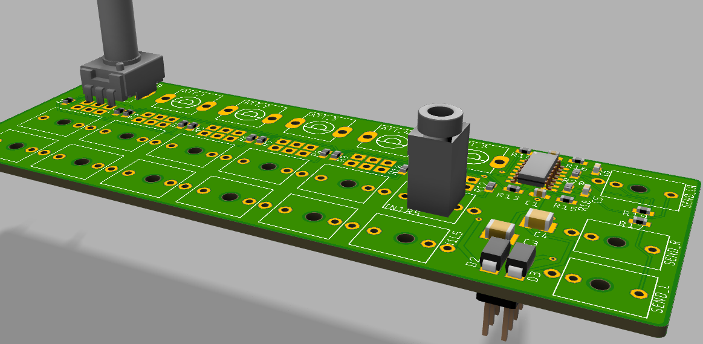

# mb'Mixa

Simple stereo mixer for eurorack.

## Status

Not tested, alpha phase !!!

## Features:
* 6 channels
* -oo .... +12dB gain.
* When right channel is unconnected, the left will be normalized to both channels.
* Want a stereo AUX in ? You can put a true stereo jack (green PM301cm) on the right jack position and leave the left unpopulated. (Channels are twisted then :( mhm might change later.. ))

## BOM

https://www.mouser.com/ProjectManager/ProjectDetail.aspx?AccessID=f7be203a88 

### Jacks

Watch out for the thin leads, 2 underneath one at the side pointing down.

From Cina or UK: https://www.thonk.co.uk/shop/3-5mm-jacks/
* Stereo sometimes called PJ366ST
* Mono "THONKICONN" or PJ301CM?